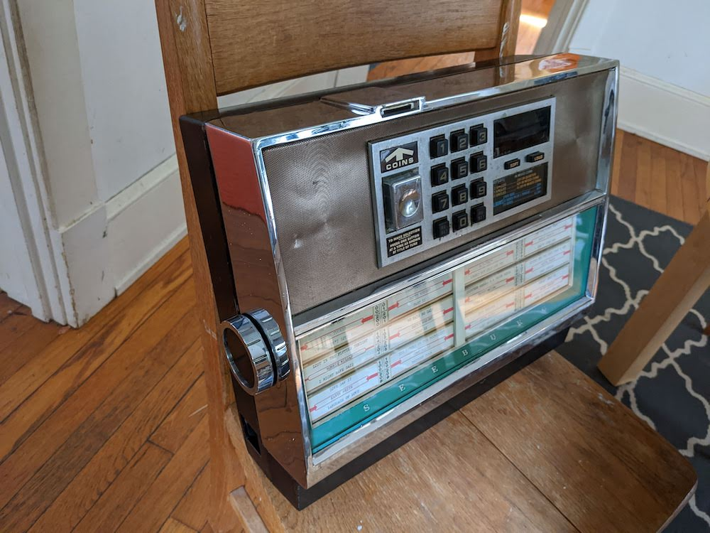

# jukebox
 
I bought a tabletop jukebox at an antique store and had the idea that it would be nice to be able to use it and make it play. Play what? Spotify. They have some pretty amazing APIs, so the journey shouldn't be too painful. 

## Overview

### What's the plan
My tabletop jukebox has a mechanical 12 button keypad, which means that at some point each button is acting as a switch to close a circuit (make a circuit complete). Each of those buttons is also connected to a pinout on the side of the keypad device. The idea is to connect those pins (and the switches they connect to) to a low voltage source that can be measured by the GPIO (general purpose in/out) of a Raspberry PI. From there, have the Pi read those voltage inputs in Python. Low voltage means the pin isn't pressed, high voltage means the circuit has been closed and a pin has been triggered. Then, the same program on the Pi will turn those inputs into numbers that correspond to the numbers pressed and the 3-digit song selection displayed on the song "rolodex' on the jukebox display. The program will then choose a matching song on an ordered playlist that is saved on Spotify and tell it to play on the specified device (which is the Pi also.) There's actually some flexibility to specify a different device that is on my account, but that's a future upgrade. 

And then we're dancing! 

### Keyboard mapping challenge
One of the more challenging parts was to decipher which digital keys on the keypad triggered which buttons on the keyboard pinout and then deciding which pins to run voltage through, and which pins were the signal to determine a button had been pressed. In many devices, 3 x 4 button keypads use a matrix of 12 pins to determine which button was pressed. All buttons are in colums and rows, and there are pins that corresond to each column or row. This keypad was not like this, so I had to open it up and manually test each end point with an ohms meter. However, once you have the mapping, then you understand that keyboard. It still required mapping two pins for each button pressed, which makes the code re-usable for other two-pin buttons. 

This keypad also has a 'click' button which makes a noise and sends a brief blip for ALL buttons when pressed. If I have trouble with noisy inputs or slow performance, I may need to use this button to tell me the program to "check pins now" 

## How to use it
Developed on Python 3.10 

### Install dependancies:
- Spotipy (note the 'py' instead of 'fy')
    - `pip install spotipy`

### Set ENV variables
- Create an account on [Spotify's Developer site](https://developer.spotify.com/) . 
- Link your premium spotify account to it.
- Set up an "application" which will give you values for these three variables.
    - `SPOTIPY_CLIENT_ID`
    - `SPOTIPY_CLIENT_SECRET`
    - `SPOTIPY_REDIRECT_URI`

